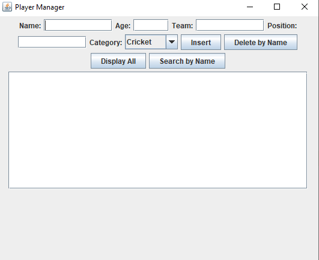

# Player Management System

This is a simple Java OOP project that manages players from various sports using a GUI. The data is stored in a MySQL database.

---

## 📂 Features

- Add, delete, search, and display players
- Categorized by sport (Cricket, Football, Basketball, Tennis)
- GUI using Java Swing
- MySQL database integration
- Uses OOP principles (inheritance, interfaces, abstraction)

---

## 🖼️ GUI Preview



---

## 🗃️ Database Schema

```sql
CREATE DATABASE PlayerDB;

USE PlayerDB;

CREATE TABLE players (
    id INT AUTO_INCREMENT PRIMARY KEY,
    name VARCHAR(100),
    age INT,
    category VARCHAR(50),
    team VARCHAR(100),
    position VARCHAR(100)
);
